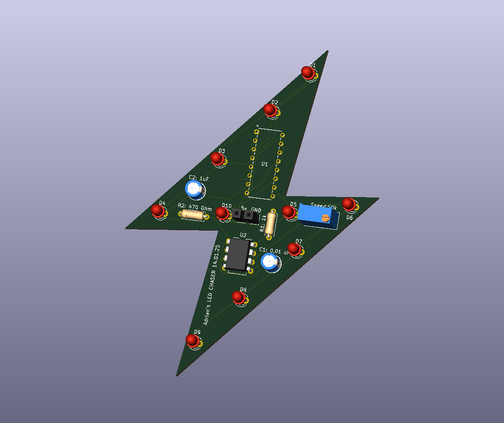
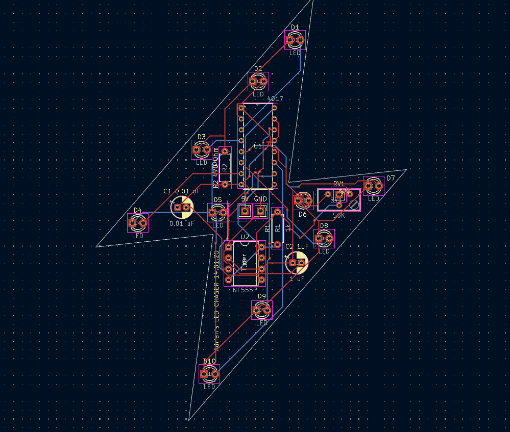
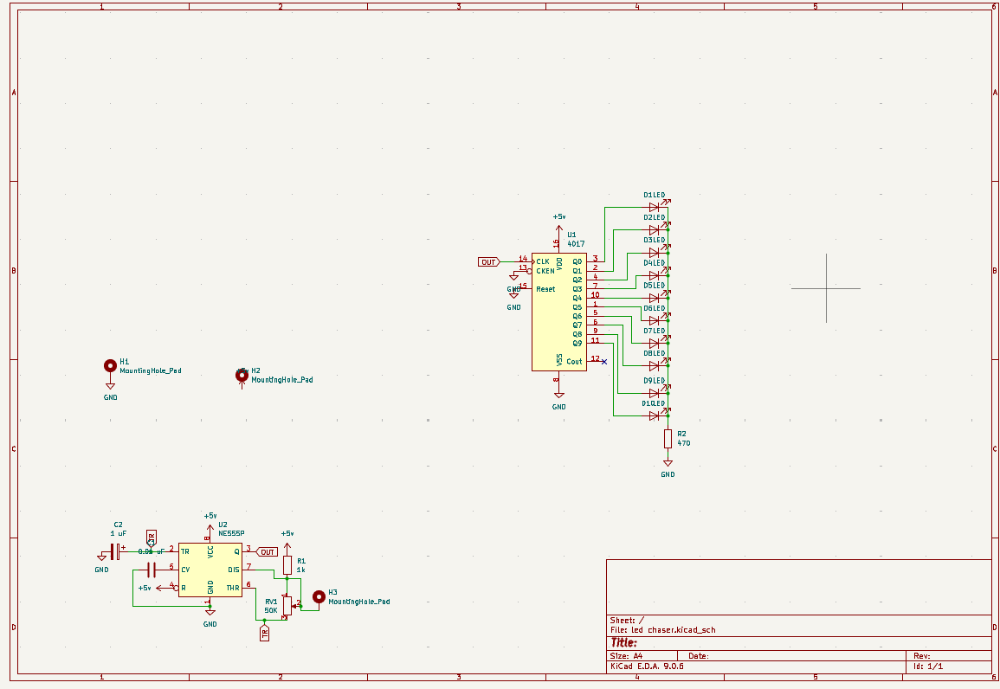

# LED CHASER 
### Samples
### PCB

### PCB DESIGN

### Schematics

A small 10x LED chaser that is using the a
- a timer ic
- a 4017 ic

# BOM
| Quantity | Component           |
|:--------:|:-------------------:|
| 10        | LEDs 3mm  | 
| 1        | 50k Potentiometer|
| 1        | 470 Ohm Rezistor | 
| 1       | 1k Rezistor       |
| 1        | 0.01 uF Capacitator|
| 1        |1 uF Capacitator  | 
| 1        |4017 IC  | 
| 1        |NE555P IC  | 
